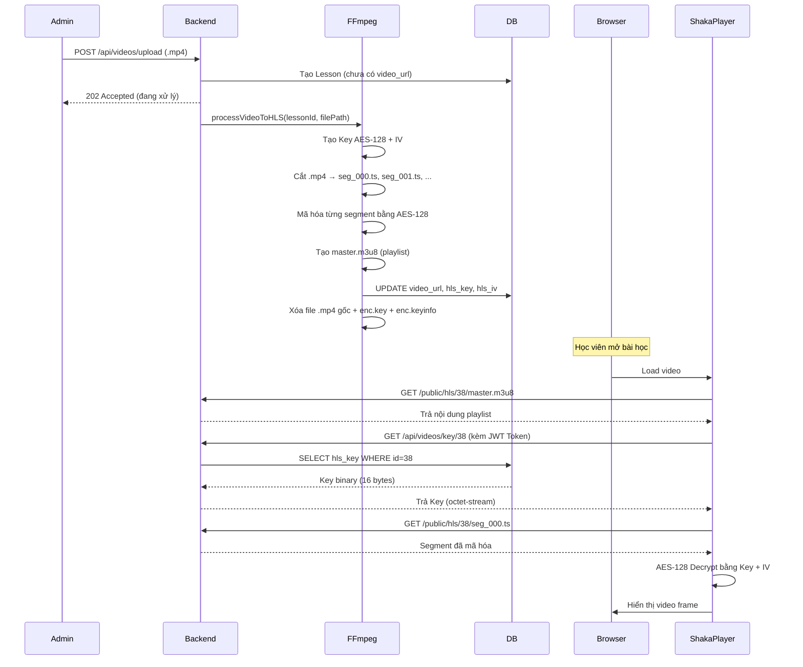

# Cơ chế Băm Video HLS - Từ .MP4 đến Đường Link trên Trình Duyệt

Tài liệu này giải thích chi tiết cách hệ thống **chuyển đổi file .mp4 gốc thành luồng video bảo mật HLS**, lưu URL vào database, và cách trình duyệt tải/giải mã video.

---

## 🔄 Tổng quan Pipeline

```
[Upload .mp4] → [FFmpeg Transcoding] → [Tạo HLS Segments + Key AES-128]
     → [Lưu URL + Key vào DB] → [Trình duyệt tải manifest.m3u8]
     → [Xin Key giải mã từ API] → [Phát video đã giải mã]
```

---

## 📥 Bước 1: Upload Video (.mp4)

**File**: `video.controller.js` → `uploadVideo()`

1. Admin chọn file `.mp4` từ giao diện quản trị.
2. File được gửi qua `POST /api/videos/upload` kèm `title` và `section_id`.
3. Middleware `Multer` lưu file tạm vào thư mục upload (VD: `uploads/abc123.mp4`).
4. Controller tạo bản ghi `Lesson` mới trong DB (chưa có `video_url`).
5. Gọi `videoService.processVideoToHLS(lessonId, filePath)` chạy **ngầm trong background**.
6. Trả về `202 Accepted` ngay lập tức (không chờ FFmpeg xong).

### 1.1 Các hình thức Source khác (Không băm)
Nếu Admin dán **Link** trực tiếp:
- **YouTube**: Phát qua VideoJs-Youtube.
- **MP4 Link**: Phát trực tiếp qua trình phát link server.
- **HLS Link (.m3u8)**: Phát qua Shaka Player (Giữ nguyên link nếu là link ngoại `http`, tự thêm host nếu là link nội bộ).

```javascript
// video.controller.js
const lesson = await prisma.lesson.create({
    data: { title, section_id: parseInt(section_id), type: 'VIDEO' }
});
videoService.processVideoToHLS(lesson.id, req.file.path); // Chạy ngầm
res.status(202).json({ message: 'Video is being processed...' });
```

---

## ⚙️ Bước 2: FFmpeg Băm Video (Transcoding)

**File**: `video.service.js` → `processVideoToHLS()`

### 2.1 Tạo Key mã hóa AES-128

```javascript
const key = crypto.randomBytes(16);     // 16 bytes = 128 bit
const iv = crypto.randomBytes(16).toString('hex');  // Initialization Vector
```

- `key`: Binary 16 bytes, sẽ **lưu thẳng vào DB** (cột `hls_key` kiểu `Bytes`).
- `iv`: Chuỗi hex 32 ký tự, lưu vào DB (cột `hls_iv`).

### 2.2 Tạo file tạm cho FFmpeg

FFmpeg cần 2 file tạm để biết cách mã hóa:

| File | Nội dung |
|---|---|
| `enc.key` | Binary key 16 bytes (ghi trực tiếp) |
| `enc.keyinfo` | 3 dòng: URL xin key ↵ Đường dẫn file key ↵ IV |

```text
# Nội dung enc.keyinfo (3 dòng):
http://localhost:5000/api/videos/key/38    ← URL trình duyệt sẽ gọi để xin key
D:/SecurityVideo/backend/public/hls/38/enc.key  ← FFmpeg đọc key từ file này
647cf566b5d773ca00e16285cea08608            ← IV (hex)
```

### 2.3 Chạy FFmpeg cắt video

FFmpeg nhận file `.mp4` gốc và cắt thành nhiều phân đoạn `.ts` nhỏ (mỗi đoạn ~4 giây):

```javascript
const ffmpegArgs = [
    '-i', inputPath,                          // Input: file .mp4 gốc
    '-vf', 'scale=1280:720:...',              // Scale xuống 720p
    '-c:v', 'libx264',                        // Codec video: H.264
    '-preset', 'veryfast',                    // Tốc độ nén nhanh
    '-crf', '26',                             // Chất lượng (26 = nén vừa, vẫn nét)
    '-c:a', 'aac', '-b:a', '128k',           // Audio: AAC 128kbps
    '-hls_time', '4',                         // Mỗi segment dài 4 giây
    '-hls_playlist_type', 'vod',              // Video theo yêu cầu (không live)
    '-hls_key_info_file', keyInfoPath,        // ★ File chứa thông tin mã hóa
    '-hls_segment_filename', '.../seg_%03d.ts', // Tên file segment
    masterPlaylist                            // Output: master.m3u8
];
```

### 2.4 Cơ chế giảm dung lượng (Compression & Scaling)
Hệ thống không chỉ băm mà còn nén video để tiết kiệm dung lượng server:
- **Chuẩn hóa độ phân giải (`scale=1280:720`)**: Tự động hạ độ phân giải về 720p (HD). Nếu upload video 4K hoặc 1080p, file sẽ được thu nhỏ để giảm tải.
- **Codec H.264 (`libx264`)**: Chuẩn nén phổ biến nhất, cho chất lượng tốt ở dung lượng thấp.
- **Tham số CRF (`-crf 26`)**: Quyết định mức độ nén. CRF=26 là mức nén tối ưu (kích thước file giảm từ 50-80% so với gốc) mà mắt thường vẫn thấy sắc nét.
- **Nén âm thanh (`aac`, `128k`)**: Chuyển đổi audio sang AAC 128kbps để tiết kiệm bộ nhớ.

### 2.4 Kết quả sau khi FFmpeg chạy xong

Thư mục `backend/public/hls/{lessonId}/` sẽ chứa:

```
backend/public/hls/38/
├── master.m3u8    ← File "danh sách phát" (playlist)
├── seg_000.ts     ← Phân đoạn 0 (4 giây, đã mã hóa AES-128)
├── seg_001.ts     ← Phân đoạn 1
├── seg_002.ts     ← Phân đoạn 2
├── ...
└── seg_010.ts     ← Phân đoạn cuối
```

> **Lưu ý**: File `enc.key` và `enc.keyinfo` bị **xóa ngay** sau khi FFmpeg xong. Key chỉ còn tồn tại trong DB.

### 2.5 Cơ chế Băm theo yêu cầu (Lazy Transcoding)
**File**: `video.service.js` → `ensureHLS()`

Nếu một bải học có `source_url` (link gốc) nhưng chưa có file HLS vật lý trên ổ cứng (do bị xóa hoặc chưa băm):
1. Khi học viên truy cập, Backend gọi `ensureHLS`.
2. Hệ thống tự động tải file từ `source_url` về thư mục tạm.
3. Kích hoạt quy trình băm HLS ngầm.
4. Trình duyệt nhận mã `202 Processing` và tự động retry sau vài giây cho đến khi `master.m3u8` xuất hiện.

---

## 💾 Bước 3: Lưu URL vào Database

Sau khi FFmpeg chạy xong (code = 0), hệ thống cập nhật bản ghi Lesson:

```javascript
await prisma.lesson.update({
    where: { id: lessonId },
    data: {
        video_url: `/public/hls/${lessonId}/master.m3u8`,  // ★ Đường link lưu DB
        hls_key: key,        // Key binary 16 bytes
        hls_iv: iv,          // IV hex string
        duration: duration   // Thời lượng (giây)
    }
});
```

**Quan trọng**: `video_url` lưu trong DB là **đường dẫn tương đối**, VD:
```
/public/hls/38/master.m3u8
```

Express serve thư mục `public/` như static files:
```javascript
// app.js
app.use('/public', express.static(path.join(__dirname, '../public')));
```

Nên URL đầy đủ trên trình duyệt sẽ là:
```
http://localhost:5000/public/hls/38/master.m3u8
```

---

## 📄 Bước 4: Nội dung file master.m3u8

File `.m3u8` là một **playlist text** mà trình phát video đọc để biết cần tải những gì:

```m3u8
#EXTM3U
#EXT-X-VERSION:3
#EXT-X-TARGETDURATION:8
#EXT-X-MEDIA-SEQUENCE:0
#EXT-X-PLAYLIST-TYPE:VOD
#EXT-X-KEY:METHOD=AES-128,URI="http://localhost:5000/api/videos/key/38",IV=0x647cf566b5d773ca00e16285cea08608
#EXTINF:8.333333,
seg_000.ts
#EXTINF:8.333333,
seg_001.ts
...
#EXT-X-ENDLIST
```

| Dòng | Ý nghĩa |
|---|---|
| `#EXT-X-KEY` | ★ Chỉ dẫn mã hóa: phương thức AES-128, URL để xin key, và IV |
| `URI="http://.../key/38"` | Trình duyệt sẽ gọi API này để lấy key giải mã |
| `IV=0x647c...` | Vector khởi tạo cho thuật toán AES |
| `seg_000.ts` | Tên file phân đoạn (trình duyệt tải từ cùng thư mục) |
| `#EXTINF:8.333333` | Thời lượng mỗi phân đoạn (8.3 giây) |

---

## 🌐 Bước 5: Trình duyệt phát Video (F12 Network)

**File**: `VideoPlayer.tsx` (sử dụng **Shaka Player**)

### 5.1 Luồng Request trên F12 (Network Tab)

Khi mở trang học và chọn bài, trình duyệt thực hiện:

```
① GET /public/hls/38/master.m3u8     ← Tải playlist
② GET /api/videos/key/38              ← Xin key giải mã (có gắn JWT Token)
③ GET /public/hls/38/seg_000.ts       ← Tải segment 0 (đã mã hóa)
④ GET /public/hls/38/seg_001.ts       ← Tải segment 1
⑤ GET /public/hls/38/seg_002.ts       ← Tải tiếp khi xem đến...
```

### 5.2 Shaka Player gắn JWT Token

Shaka Player sử dụng **Request Filter** để tự động gắn Token vào mọi request:

```typescript
player.getNetworkingEngine().registerRequestFilter((type, request) => {
    const uri = request.uris[0];
    // Chỉ gắn Token nếu là request tới Server của mình (localhost:5000)
    const isInternal = uri.startsWith('http://localhost:5000') || uri.startsWith('/');

    if (isInternal) {
        const token = localStorage.getItem('accessToken');
        if (token) request.headers['Authorization'] = `Bearer ${token}`;
        request.allowCrossSiteCredentials = true;
    }

    // Thêm timestamp chống cache cho Manifest và Key
    if (type === MANIFEST || uri.includes('/key/')) {
        request.uris[0] += (uri.includes('?') ? '&' : '?') + 't=' + Date.now();
    }
});
```

> **Tại sao cần IsInternal?** Nếu không kiểm tra, Shaka sẽ gửi Authorization Header sang cả các server ngoại (như YouTube hay link HLS ngoài), dẫn đến lỗi CORS hoặc bị từ chối kết nối.

### 5.3 Backend trả Key

Khi trình duyệt gọi `GET /api/videos/key/38`:

1. **Auth Middleware** kiểm tra JWT Token → xác định user.
2. Controller gọi `videoService.getVideoKey(38)`.
3. Service query DB lấy `hls_key` (binary 16 bytes).
4. Trả về dạng `application/octet-stream` (binary thô).

```javascript
// video.controller.js
exports.getVideoKey = catchAsync(async (req, res) => {
    const key = await videoService.getVideoKey(lessonId);
    res.set('Content-Type', 'application/octet-stream');
    res.set('Cache-Control', 'no-store');  // Không cache key!
    res.send(key);
});
```

### 5.4 Giải mã và phát

```
seg_000.ts (mã hóa) + Key (16 bytes) + IV → AES-128 Decrypt → Video frame → Hiển thị
```

Quá trình này xảy ra **trong bộ nhớ trình duyệt**, video giải mã **không bao giờ được lưu thành file**.

---

## 🧩 Bước 6: Blob URL — Đường link `blob:` trên F12 Elements

Khi bạn mở F12 → Elements → thẻ `<video>`, bạn sẽ thấy:

```html
<source src="blob:http://localhost:5173/39d8ab6f-952f-4f97-aa1b-9569089fbeae" type="video/mp4">
```

### Đây là gì?

Đây là **Blob URL** — một đường link ảo do trình duyệt tự tạo ra, **không phải link thật trên server**.

### Luồng tạo Blob URL

```
Shaka Player tải seg_000.ts (mã hóa) từ server
        ↓
Giải mã AES-128 bằng Key + IV (trong RAM)
        ↓
Ghép các segment thành 1 khối dữ liệu video (Blob object)
        ↓
Trình duyệt gọi URL.createObjectURL(blob) → "blob:http://localhost:5173/..."
        ↓
Gán vào <video src="blob:..."> để phát
```

### Tại sao dùng Blob URL?

| Đặc tính | Ý nghĩa bảo mật |
|---|---|
| **Chỉ tồn tại trong tab hiện tại** | Copy link sang tab khác → không mở được |
| **Nằm hoàn toàn trong RAM** | Không có file nào trên server tương ứng |
| **Đóng tab = mất dữ liệu** | Blob bị giải phóng khỏi bộ nhớ |
| **UUID ngẫu nhiên** | `39d8ab6f-...` là ID duy nhất, không đoán được |
| **Không thể download** | Chuột phải "Save as" hoặc copy link đều vô nghĩa |

> **Kết luận**: Blob URL là lớp bảo vệ cuối cùng. Ngay cả khi ai đó thấy link trên F12, họ cũng không thể tải video vì link đó chỉ là "tên gọi tạm" cho dữ liệu đã giải mã trong RAM của trình duyệt.

---

## 🔒 Tóm tắt Bảo mật

| Lớp | Cơ chế |
|---|---|
| **Mã hóa** | AES-128 (mỗi segment .ts đều bị mã hóa) |
| **Key Storage** | Key binary lưu trong DB, file key tạm bị xóa ngay |
| **Key Delivery** | API `/api/videos/key/:id` yêu cầu JWT Token hợp lệ |
| **Anti-Cache** | Key request gắn timestamp `?t=...` để chống cache |
| **Anti-Download** | `controlsList="nodownload"`, chuột phải bị chặn |
| **Anti-Seek** | Logic chống tua nhanh (delta > 1.2s bị reset) |

---

## 📊 Sơ đồ tổng thể (Mermaid)



---

## 📂 Cấu trúc File trên Disk

```
backend/
├── public/
│   └── hls/
│       ├── 38/                    ← Lesson ID 38
│       │   ├── master.m3u8       ← Playlist (chứa link xin key + danh sách segment)
│       │   ├── seg_000.ts        ← Segment 0 (mã hóa AES-128)
│       │   ├── seg_001.ts
│       │   └── ...
│       ├── 39/                    ← Lesson ID 39
│       │   ├── master.m3u8
│       │   └── ...
│       └── ...
```

## 💡 Trên F12 DevTools (Network Tab) bạn sẽ thấy

| Request | Type | Size | Mô tả |
|---|---|---|---|
| `master.m3u8?t=1713...` | xhr | ~500B | Playlist text |
| `key/38?t=1713...` | xhr | 16B | Key giải mã (binary) |
| `seg_000.ts` | xhr | ~200KB | Segment video (mã hóa) |
| `seg_001.ts` | xhr | ~200KB | Segment video (mã hóa) |
| ... | ... | ... | Tải dần khi xem |
