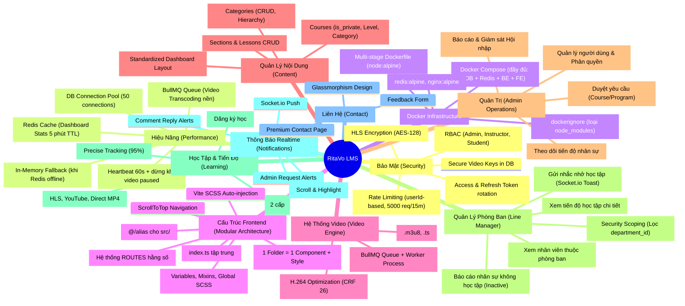

# Mind Map - RitaVo LMS Project

Tài liệu này trình bày sơ đồ tư duy (Mind Map) về các thành phần và tính năng cốt lõi của hệ thống RitaVo LMS.

## 🧠 Sơ đồ tư duy hệ thống (Visualized with Mermaid)

---

## 🔍 Phân tích chi tiết các khối

### 1. Khối Bảo Mật (Security)
Đây là "trái tim" của dự án. Không chỉ là Login/Logout, mà còn là việc bảo vệ tài sản số (Video). 
- **Cơ chế**: Video được cắt nhỏ. Mỗi khi trình duyệt muốn xem một đoạn video, nó phải xin "chìa khóa" (Key) từ server. Server chỉ cấp khóa nếu User đã mua khóa học đó.

### 2. Khối Video Engine
Thay vì dùng các dịch vụ đắt đỏ như Bunny.net, dự án tự xây dựng bộ engine:
- **Tối ưu**: Nén video cực nhẹ (CRF 26) nhưng vẫn nét 1080p.
- **Tự động**: Tự động băm video ngay khi upload xong.

### 3. Khối Content & Learning
Cấu trúc phân cấp đa tầng: `Category` -> `Course` -> `Section` -> `Lesson`.
- **Quản lý Danh mục**: Phân loại khóa học linh hoạt giúp người dùng dễ dàng tìm kiếm.
- **Hỗ trợ tracking tiến độ**: Hệ thống theo dõi chính xác đến 95% thời lượng video để ghi nhận hoàn thành.
- **Đa dạng nguồn video**: Hỗ trợ HLS (bảo mật cao), YouTube và các link video trực tiếp.
- **Hệ thống bình luận Facebook-style**: 2 cấp cố định (Parent + Replies). Reply vào reply sẽ tự động gộp vào cùng cấp.

### 4. Khối Quản Trị & Thông báo Realtime
Dành riêng cho Admin để vận hành hệ thống:
- **Duyệt yêu cầu**: Hệ thống quản lý yêu cầu tham gia khóa học/lộ trình từ nhân sự.
- **Theo dõi tiến độ**: Admin có thể xem chi tiết phần trăm hoàn thành của từng nhân sự trong mỗi khóa học.
- **Thông báo Realtime**: Push qua Socket.io khi có người phản hồi bình luận hoặc có yêu cầu mới cần duyệt.
- Click thông báo để nhảy thẳng tới vị trí cần xử lý (bình luận hoặc trang duyệt).
### 5. Khối Quản Lý Phòng Ban (Line Manager Subsystem)
Dành riêng cho Quản lý phòng ban (Line Manager) để theo dõi và đôn đốc học tập:
- **Bảo mật dữ liệu (Security Scoping)**: Lọc nghiêm ngặt dữ liệu nhân viên theo `department_id` của manager ở cả tầng Controller & Service, ngăn rò rỉ dữ liệu chéo.
- **Xem nhân sự & Tiến độ chi tiết**: Hiển thị danh sách nhân sự trực thuộc phòng ban, tiến độ hoàn thành các khóa học bắt buộc và tự chọn.
- **Báo cáo Inactive**: Xác định nhân sự không tham gia học tập trong vòng N ngày gần nhất (thời lượng học = 0 hoặc bài học hoàn thành = 0).
- **Gửi nhắc nhở trực tiếp**: Cho phép gửi thông điệp nhắc nhở học tập thời gian thực tới tài khoản của nhân viên qua Socket.io Toast và lưu vào Notification DB.

### 6. Khối Lộ Trình Bắt Buộc & Phân Phối (Intelligent Scoping)
Cơ chế kiểm soát việc bắt buộc học tập đối với từng nhóm đối tượng:
- **Phân phối linh hoạt (Intelligent Scoping)**: Áp dụng lộ trình cho Toàn bộ nhân viên, Theo phòng ban, Theo vị trí, Nhân viên cụ thể hoặc Chỉ dành cho nhân viên mới (tính từ ngày vào làm `join_date` dưới 90 ngày).
- **Ràng buộc thời hạn hoàn thành (Deadline Consistency Guard)**: Backend tự động so khớp thời hạn. Ngăn chặn việc cấu hình thời hạn hoàn thành của Lộ trình học ngắn hơn thời hạn hoàn thành của bất kỳ khóa học con nào thuộc lộ trình đó, tránh xung đột logic.

### 7. Khối SPA (Single Page Application)
Giao diện React hiện đại:
- Không load lại trang (Smooth transitions).
- Layout tập trung (`MainLayout` & `AdminLayout` với sidebar thích ứng động cho manager).
- Ant Design v6 UI mượt mà.

---

## 🎯 Mục tiêu phát triển tương lai
- [x] Hệ thống bình luận bài học (Facebook-style 2 cấp)
- [x] Thông báo Realtime khi có phản hồi (Socket.io)
- [x] Click thông báo để nhảy tới bình luận cụ thể
- [x] Trang Liên hệ (Contact) chuyên nghiệp
- [x] Hệ thống Quản lý Danh mục & Phân loại khóa học
- [x] Hệ thống Duyệt yêu cầu & Theo dõi Tiến độ Admin
- [x] Đồng bộ hóa giao diện Dashboard (Standardized UI)
- [x] Hệ thống Khóa học bắt buộc & Báo cáo hội nhập (Mandatory Onboarding)
- [x] Phân hệ Quản lý Phòng ban cho Line Manager (Line Manager Subsystem)
- [x] Bộ lọc thông minh Scoping và cơ chế Ràng buộc thời hạn (Intelligent Scoping & Deadline Guards)
- [x] **Tối ưu hiệu năng cho 100 người dùng đồng thời** (BullMQ Queue, Redis Cache, Smart Rate Limiter, DB Pool)
- [x] **Hạ tầng Docker đầy đủ** (Multi-stage Dockerfile, docker-compose.yml với 4 dịch vụ)
- [ ] Tích hợp Livestream dạy học trực tuyến.
- [ ] App Mobile (React Native) sử dụng chung Backend API.
- [ ] Hệ thống AI gợi ý khóa học dựa trên hành vi học tập.
