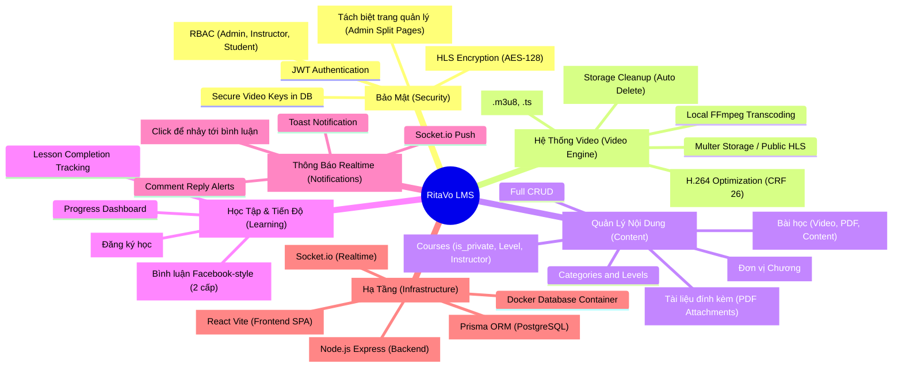

# Mind Map - RitaVo LMS Project

Tài liệu này trình bày sơ đồ tư duy (Mind Map) về các thành phần và tính năng cốt lõi của hệ thống RitaVo LMS.

## 🧠 Sơ đồ tư duy hệ thống (Visualized with Mermaid)

---

## 🔍 Phân tích chi tiết các khối

### 1. Khối Bảo Mật (Security)
Đây là "trái tim" của dự án. Không chỉ là Login/Logout, mà còn là việc bảo vệ tài sản số (Video). 
- **Cơ chế**: Video được cắt nhỏ. Mỗi khi trình duyệt muốn xem một đoạn video, nó phải xin "chìa khóa" (Key) từ server. Server chỉ cấp khóa nếu User đã mua khóa học đó.

### 2. Khối Video Engine
Thay vì dùng các dịch vụ đắt đỏ như Bunny.net, dự án tự xây dựng bộ engine:
- **Tối ưu**: Nén video cực nhẹ (CRF 26) nhưng vẫn nét 1080p.
- **Tự động**: Tự động băm video ngay khi upload xong.

### 3. Khối Content & Learning
Cấu trúc phân cấp 4 tầng: `Category` -> `Course` -> `Section` -> `Lesson`.
- Hỗ trợ tracking tiến độ học viên (Học đến đâu, hoàn thành bài nào).
- **Hệ thống bình luận Facebook-style**: 2 cấp cố định (Parent + Replies). Reply vào reply sẽ tự động gộp vào cùng cấp.

### 4. Khối Thông báo Realtime (Socket.io)
- Thông báo push qua Socket.io khi có người phản hồi bình luận.
- Click thông báo để nhảy thẳng tới vị trí bình luận (scroll + highlight).
- Hiển thị toast notification góc dưới bên phải.

### 5. Khối SPA (Single Page Application)
Giao diện React hiện đại:
- Không load lại trang (Smooth transitions).
- Layout tập trung (`MainLayout`).
- Ant Design v6 UI mượt mà.

---

## 🎯 Mục tiêu phát triển tương lai
- [x] Hệ thống bình luận bài học (Facebook-style 2 cấp)
- [x] Thông báo Realtime khi có phản hồi (Socket.io)
- [x] Click thông báo để nhảy tới bình luận cụ thể
- [ ] Tích hợp Livestream dạy học trực tuyến.
- [ ] App Mobile (React Native) sử dụng chung Backend API.
- [ ] Hệ thống AI gợi ý khóa học dựa trên hành vi học tập.
