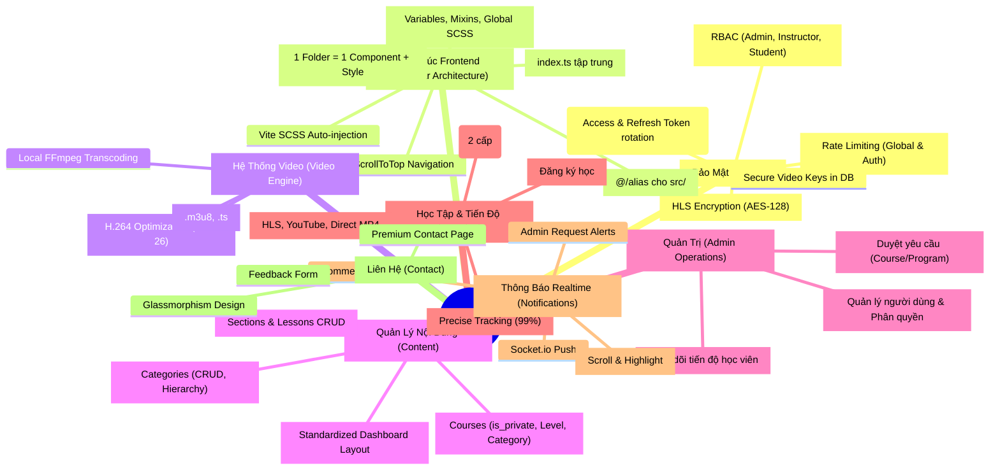

# Mind Map - RitaVo LMS Project

Tài liệu này trình bày sơ đồ tư duy (Mind Map) về các thành phần và tính năng cốt lõi của hệ thống RitaVo LMS.

## 🧠 Sơ đồ tư duy hệ thống (Visualized with Mermaid)

---

## 🔍 Phân tích chi tiết các khối

### 1. Khối Bảo Mật (Security)
Đây là "trái tim" của dự án. Không chỉ là Login/Logout, mà còn là việc bảo vệ tài sản số (Video). 
- **Cơ chế**: Video được cắt nhỏ. Mỗi khi trình duyệt muốn xem một đoạn video, nó phải xin "chìa khóa" (Key) từ server. Server chỉ cấp khóa nếu User đã mua khóa học đó.

### 2. Khối Video Engine
Thay vì dùng các dịch vụ đắt đỏ như Bunny.net, dự án tự xây dựng bộ engine:
- **Tối ưu**: Nén video cực nhẹ (CRF 26) nhưng vẫn nét 1080p.
- **Tự động**: Tự động băm video ngay khi upload xong.

### 3. Khối Content & Learning
Cấu trúc phân cấp đa tầng: `Category` -> `Course` -> `Section` -> `Lesson`.
- **Quản lý Danh mục**: Phân loại khóa học linh hoạt giúp người dùng dễ dàng tìm kiếm.
- **Hỗ trợ tracking tiến độ**: Hệ thống theo dõi chính xác đến 99% thời lượng video để ghi nhận hoàn thành.
- **Đa dạng nguồn video**: Hỗ trợ HLS (bảo mật cao), YouTube và các link video trực tiếp.
- **Hệ thống bình luận Facebook-style**: 2 cấp cố định (Parent + Replies). Reply vào reply sẽ tự động gộp vào cùng cấp.

### 4. Khối Quản Trị & Thông báo Realtime
Dành riêng cho Admin để vận hành hệ thống:
- **Duyệt yêu cầu**: Hệ thống quản lý yêu cầu tham gia khóa học/lộ trình từ học viên.
- **Theo dõi tiến độ**: Admin có thể xem chi tiết phần trăm hoàn thành của từng học viên trong mỗi khóa học.
- **Thông báo Realtime**: Push qua Socket.io khi có người phản hồi bình luận hoặc có yêu cầu mới cần duyệt.
- Click thông báo để nhảy thẳng tới vị trí cần xử lý (bình luận hoặc trang duyệt).

### 5. Khối SPA (Single Page Application)
Giao diện React hiện đại:
- Không load lại trang (Smooth transitions).
- Layout tập trung (`MainLayout`).
- Ant Design v6 UI mượt mà.

---

## 🎯 Mục tiêu phát triển tương lai
- [x] Hệ thống bình luận bài học (Facebook-style 2 cấp)
- [x] Thông báo Realtime khi có phản hồi (Socket.io)
- [x] Click thông báo để nhảy tới bình luận cụ thể
- [x] Trang Liên hệ (Contact) chuyên nghiệp
- [x] Hệ thống Quản lý Danh mục & Phân loại khóa học
- [x] Hệ thống Duyệt yêu cầu & Theo dõi Tiến độ Admin
- [x] Đồng bộ hóa giao diện Dashboard (Standardized UI)
- [ ] Tích hợp Livestream dạy học trực tuyến.
- [ ] App Mobile (React Native) sử dụng chung Backend API.
- [ ] Hệ thống AI gợi ý khóa học dựa trên hành vi học tập.
