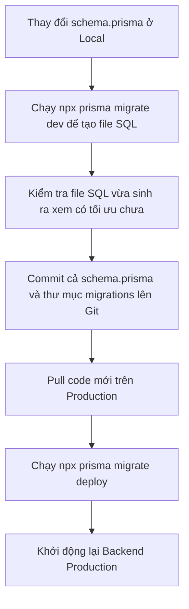

# Hướng Dẫn Quản Lý Database Migration Với Prisma

Tài liệu này quy định các nguyên tắc vận hành, đồng bộ cấu trúc cơ sở dữ liệu (Database Schema) bằng Prisma Migrate giữa các môi trường (Development, Staging, Production) nhằm đảm bảo hệ thống hoạt động ổn định, tránh xung đột lịch sử migration và **tuyệt đối không làm mất mát dữ liệu (Data Loss) trên môi trường Production**.

---

## 1. Cơ Chế Hoạt Động Của Prisma Migrate

Prisma quản lý cấu trúc database thông qua hai thành phần:
* **Thư mục Migration trên đĩa (`backend/prisma/migrations/*`):** Chứa các file SQL tăng dần theo thời gian.
* **Bảng lịch sử trong Database (`_prisma_migrations`):** Lưu trữ danh sách các file migration đã được chạy thành công trên database đó cùng với mã hash (checksum) của từng file.

Khi chạy lệnh migrate, Prisma sẽ đối chiếu mã checksum và danh sách file trên đĩa với bảng `_prisma_migrations`. Nếu phát hiện bất kỳ sự sai lệch nào (file cũ bị sửa đổi, file cũ bị xóa trên đĩa nhưng đã chạy dưới DB), Prisma sẽ báo lỗi xung đột lịch sử (Migration History Mismatch) và yêu cầu reset database.

---

## 2. Quy Tắc Vàng Khi Phát Triển Ở Môi Trường Local (Development)

Để các lập trình viên trong dự án không gặp lỗi xung đột khi pull code của nhau:

### ⛔ QUY TẮC 1: Không tự ý sửa trực tiếp file `migration.sql` cũ đã commit lên Git
* Một khi file migration đã được commit lên nhánh chung (ví dụ `dev`, `main`), file đó trở thành **lịch sử bất biến**.
* Nếu bạn muốn sửa đổi cấu trúc (thêm trường, xóa trường, đổi kiểu dữ liệu), hãy thay đổi file `schema.prisma` và dùng lệnh bên dưới để tạo ra một file migration **mới**:
  ```bash
  npx prisma migrate dev --name <ten_migration_goi_nho>
  ```

### 🔄 QUY TẮC 2: Cách xử lý khi máy khác bị yêu cầu "Reset Database"
Nếu trong quá trình phát triển, đội ngũ bắt buộc phải gộp (squash) hoặc thay đổi file migration cũ, các máy local khác khi pull code về chạy `npx prisma migrate dev` sẽ nhận được cảnh báo yêu cầu Reset DB:
> `The migration history in the database does not match the migration history on disk... Do you want to reset the database? [y/N]`
* **Cách giải quyết:** Các máy local chỉ cần nhấn **`y` (Yes)** để Prisma tự động dọn sạch DB cũ và dựng lại cấu trúc mới nhất theo lịch sử chuẩn từ Git.
* Sau khi reset thành công, hãy chạy lại lệnh seed để lấy dữ liệu mẫu:
  ```bash
  node prisma/seeds/seed.js
  ```

---

## 3. Quy Tắc Vận Hành Trên Môi Trường Production

Môi trường Production là nơi chứa dữ liệu thực tế của khách hàng, việc reset database là **tuyệt đối không được phép xảy ra**.

### 🚀 LỆNH BẮT BUỘC: Chỉ sử dụng `migrate deploy`
Trên môi trường Production (hoặc các kịch bản CI/CD Deploy tự động), **tuyệt đối không chạy** `npx prisma migrate dev`. Hãy luôn chạy lệnh:
```bash
npx prisma migrate deploy
```
* **Tại sao lệnh này an toàn?** 
  * `migrate deploy` chỉ lấy các file migration mới chưa được chạy và áp dụng chúng vào database.
  * Lệnh này **không bao giờ** tự động phát hiện thay đổi schema để tạo file mới, và **không bao giờ hỏi hoặc thực hiện reset database**.
  * Nếu lịch sử migration bị xung đột hoặc file SQL bị lỗi cú pháp, lệnh sẽ lập tức dừng lại (crash) để bảo vệ dữ liệu hiện có.

---

## 4. Chiến Thuật Thay Đổi Cấu Trúc Lớn (Tránh Lỗi Downtime & Lỗi Ràng Buộc)

Khi cần thực hiện các thay đổi lớn trên các bảng đang có dữ liệu trên Production, hãy tuân theo các hướng dẫn sau:

### A. Thêm cột bắt buộc (`NOT NULL`)
Nếu thêm một cột bắt buộc mà không có giá trị mặc định, database sẽ báo lỗi khi áp dụng lên bảng đã có dữ liệu.
* **Giải pháp:** 
  1. Thêm cột dưới dạng cho phép trống (`?` trong Prisma) hoặc thiết lập giá trị mặc định (`@default(...)`).
  2. Tạo migration và deploy lên production.
  3. *(Nếu là cột nullable)* Chạy một đoạn script/query SQL cập nhật dữ liệu cho toàn bộ các hàng cũ trong bảng.
  4. Tạo một migration thứ hai chuyển cột đó thành bắt buộc (`NOT NULL`).

### B. Đổi tên cột (Kỹ thuật Expand & Contract)
Tránh việc đổi tên cột trực tiếp bằng `RENAME COLUMN` vì sẽ làm crash ứng dụng đang chạy khi chưa kịp deploy code mới.
* **Giải pháp:**
  1. **Expand (Mở rộng):** Thêm cột mới với tên mới. Cập nhật code ứng dụng để ghi song song dữ liệu vào cả cột cũ và cột mới.
  2. **Migrate (Chuyển đổi):** Chạy script đồng bộ dữ liệu cũ từ cột cũ sang cột mới.
  3. **Contract (Thu hẹp):** Cập nhật code ứng dụng chỉ đọc/ghi trên cột mới. Sau đó tạo migration xóa cột cũ đi.

### C. Thêm cột mới vào bảng đã có dữ liệu (New fields in existing DB)
Khi dự án đã chạy trên Production và bạn muốn thêm trường mới vào bảng cũ, việc này hoàn toàn **không gây Reset database** và không mất dữ liệu cũ, với điều kiện:
* Trường mới phải được định nghĩa là **cho phép để trống (Nullable - có dấu `?` trong Prisma)** hoặc **có giá trị mặc định (`@default(...)`)**.
* Khi chạy lệnh deploy, Prisma chỉ chạy câu lệnh `ALTER TABLE ... ADD COLUMN ...` để thêm cột mới vào cấu trúc bảng hiện tại. Các hàng dữ liệu cũ ở các cột khác vẫn được giữ nguyên vẹn.
* *Lưu ý:* Tuyệt đối không thêm cột bắt buộc (`NOT NULL`) mà thiếu giá trị mặc định, vì lệnh deploy sẽ bị lỗi (dừng tiến trình) do PostgreSQL không biết gán dữ liệu gì cho các hàng cũ (tuy lỗi nhưng dữ liệu cũ vẫn được bảo vệ an toàn).

### D. Thêm bảng mới hoặc Xóa bảng cũ (Creating or Dropping Tables)
Việc thêm/xóa bảng trên Production diễn ra như sau:
* **Thêm bảng mới:** Hoàn toàn **an toàn 100%**. Khi chạy `migrate deploy`, Prisma sẽ dịch thành câu lệnh `CREATE TABLE "new_table" (...)`. Việc này chỉ tạo thêm một tài nguyên mới trong database, không đụng chạm đến bất kỳ bảng nào cũ nên **không bao giờ gây reset hay mất dữ liệu**.
* **Xóa bảng cũ:** Về mặt hệ thống thì **an toàn (không gây reset các bảng khác)**, nhưng về mặt dữ liệu thì là hành động **hủy diệt dữ liệu của bảng đó**. 
  * Khi chạy deploy, lệnh `DROP TABLE "old_table"` sẽ xóa hoàn toàn bảng đó cùng toàn bộ dữ liệu đang chứa bên trong nó trên Production. Các bảng khác không bị ảnh hưởng.
  * **Mẹo phòng ngừa lỗi (IF EXISTS):** Mặc định, Prisma tự động gen lệnh là `DROP TABLE "old_table"`. Nếu một máy nào đó đã lỡ tay xóa thủ công bảng này trước đó, lệnh migrate sẽ bị **lỗi crash** vì bảng không tồn tại. Để phòng tránh, bạn có thể mở file `migration.sql` ra sửa lại lệnh thành:
    ```sql
    DROP TABLE IF EXISTS "old_table";
    ```
    (Tương tự với `DROP TYPE IF EXISTS "EnumName";` hoặc `ALTER TABLE ... DROP CONSTRAINT IF EXISTS ...`).
  * *Lưu ý quan trọng:* Trước khi deploy lệnh xóa bảng, hãy chắc chắn rằng code ứng dụng trên Production **đã được gỡ bỏ hoàn toàn** các đoạn query liên quan đến bảng đó, nếu không backend sẽ bị crash do cố truy vấn vào bảng không tồn tại.

---

## 5. Quy Trình Các Bước Deploy Migration Chuẩn


