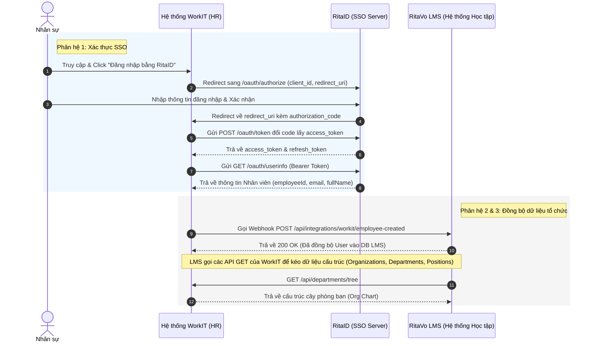

# 🚀 RitaVo LMS & WorkIT Integration Blueprint

Tài liệu này phân tích cấu trúc hiện tại của dự án **RitaVo LMS** và lập hồ sơ thiết kế, đặc tả kỹ thuật tích hợp API với nền tảng quản trị nhân sự **WorkIT** và hệ thống xác thực **RitaID (SSO)**.

---

## 📌 1. Tổng quan kiến trúc tích hợp

Hệ thống tích hợp được chia làm 3 phân hệ chính:
1. **SSO Authentication (RitaID)**: RitaID đóng vai trò là Identity Provider (IdP) cung cấp cơ chế đăng nhập một lần (Single Sign-On). WorkIT và các hệ thống vệ tinh sẽ đóng vai trò là Service Providers (SP) kết nối xác thực theo chuẩn OAuth2/OIDC.
2. **Core HR Pull APIs**: Các API truy vấn thông tin cơ cấu tổ chức (Công ty, Phòng ban, Chức danh, Nhân sự) dùng cho việc đồng bộ thủ công hoặc định kỳ.
3. **Realtime Sync Webhooks**: Các webhook phía LMS để WorkIT gọi sang ngay khi có biến động nhân sự (Thêm mới, cập nhật, thôi việc, đổi phòng ban).



---

## 🔍 2. Đánh giá khoảng cách (Gap Analysis) hệ thống LMS hiện tại

Sau khi đối chiếu mã nguồn và database hiện tại của LMS với yêu cầu tích hợp từ phía WorkIT, dưới đây là các điểm cần bổ sung/điều chỉnh trong DB và Backend:

### 2.1. Thay đổi Database Schema (`prisma/schema.prisma`)

Hiện tại, database của LMS đang lưu thông tin nhân sự và phòng ban rất đơn giản. Cần mở rộng các model để mapping chính xác dữ liệu từ WorkIT.

| Model hiện tại | Trường thiếu cần bổ sung | Kiểu dữ liệu | Mô tả & Tác dụng |
| :--- | :--- | :--- | :--- |
| **Organization** | *Chưa tồn tại* | Model mới | Lưu thông tin các Công ty/Pháp nhân thành viên trong tập đoàn. |
| **Department** | `organization_id` | Int (FK) | Liên kết phòng ban với Công ty cụ thể. |
| | `manager_id` | Int (FK) | Liên kết tới `User` quản lý phòng ban (Dùng cho Line Manager). |
| | `status` | String | Trạng thái phòng ban (`ACTIVE` / `INACTIVE`). |
| **Position** | `code` | String (Unique)| Mã chức danh/vị trí (ví dụ: `SALE`, `DEV`, `HR`). |
| | `status` | String | Trạng thái chức danh (`ACTIVE` / `INACTIVE`). |
| **User** | `status` | String | Trạng thái nhân sự (`ACTIVE` / `INACTIVE` / `RESIGNED`). |
| | `manager_id` | Int (FK) | Liên kết tới `User` là quản lý trực tiếp (Để build luồng phê duyệt). |
| | `organization_id`| Int (FK) | Công ty trực thuộc của nhân viên. |
| | `employee_code` | String (Unique)| Mã nhân viên (ví dụ: `RV0988`). |

---

## 🛠️ 3. Đặc tả chi tiết các API cần cung cấp & Tích hợp

Dưới đây là thiết kế chi tiết cho từng nhóm API để thống nhất gửi cho đơn vị phát triển WorkIT.

### Group A: SSO Authentication (RitaID cung cấp - WorkIT tích hợp)

#### 1. `GET /oauth/authorize`
*   **Mô tả**: Redirect user từ WorkIT sang RitaID để xác thực tập trung.
*   **Tham số truy vấn (Query Params)**:
    ```yaml
    client_id: "workit_app_id"       # ID ứng dụng đăng ký trên RitaID (Bắt buộc)
    redirect_uri: "https://workit.vn/callback" # URL callback sau khi login (Bắt buộc)
    response_type: "code"            # Luôn truyền là 'code' (Bắt buộc)
    scope: "openid profile email"    # Phạm vi thông tin (Tùy chọn)
    state: "random_security_string"  # Chống tấn công CSRF (Bắt buộc)
    ```
*   **Kết quả trả về**: Redirect về `redirect_uri` kèm theo query: `?code=AUTHORIZATION_CODE&state=STATE`.

#### 2. `POST /oauth/token`
*   **Mô tả**: Đổi Authorization Code lấy Access Token.
*   **Body (application/x-www-form-urlencoded hoặc json)**:
    ```json
    {
      "grant_type": "authorization_code",
      "code": "AUTHORIZATION_CODE",
      "client_id": "workit_app_id",
      "client_secret": "workit_client_secret_key",
      "redirect_uri": "https://workit.vn/callback"
    }
    ```
*   **Kết quả trả ra**:
    ```json
    {
      "access_token": "eyJhbGciOi...",
      "refresh_token": "r1.abc123xyz...",
      "token_type": "Bearer",
      "expires_in": 3600
    }
    ```

#### 3. `GET /oauth/userinfo`
*   **Mô tả**: Lấy thông tin chi tiết nhân sự vừa đăng nhập.
*   **Header**: `Authorization: Bearer <access_token>`
*   **Kết quả trả ra**:
    ```json
    {
      "employeeId": "emp_98273",
      "employeeCode": "RV0988",
      "email": "phuc.nh@ritavo.com",
      "fullName": "Nguyễn Hồng Phúc",
      "status": "ACTIVE"
    }
    ```

---

### Group B: Core Structure APIs (Do WorkIT cung cấp - LMS tích hợp để đồng bộ)

Nhóm API này do WorkIT viết để hệ thống LMS (hoặc core portal) kéo dữ liệu định kỳ bằng cronjob hoặc phục vụ tính năng tìm kiếm của Admin LMS.

#### 4. `GET /api/organizations`
*   **Mô tả**: Lấy danh sách công ty/pháp nhân.
*   **Tham số**: `page`, `pageSize`, `status`
*   **Kết quả trả ra**:
    ```json
    {
      "data": [
        { "id": 1, "code": "RTV_HOLDING", "name": "RitaVo Group", "status": "ACTIVE" },
        { "id": 2, "code": "RTV_AUTO", "name": "RitaVo Auto", "status": "ACTIVE" }
      ],
      "pagination": { "page": 1, "pageSize": 10, "total": 2 }
    }
    ```

#### 5. `GET /api/departments`
*   **Mô tả**: Lấy danh sách phòng ban phẳng (Flat List).
*   **Tham số**: `organizationId`, `parentId`, `keyword`, `status`, `page`, `pageSize`
*   **Kết quả trả ra**:
    ```json
    {
      "data": [
        {
          "id": 12,
          "organization_id": 1,
          "name": "Phòng Công Nghệ Thông Tin",
          "description": "Chịu trách nhiệm hạ tầng CNTT & Phần mềm",
          "parent_id": 1,
          "manager_id": 88,
          "status": "ACTIVE"
        }
      ]
    }
    ```

#### 6. `GET /api/departments/tree`
*   **Mô tả**: Lấy cây phân cấp phòng ban (Quan trọng nhất để dựng Org Chart và quản lý phân bổ học tập theo cấp).
*   **Tham số**: `organizationId`, `status`
*   **Kết quả trả ra**:
    ```json
    [
      {
        "id": 1,
        "name": "Ban Giám Đốc",
        "children": [
          {
            "id": 12,
            "name": "Phòng CNTT",
            "children": [
              { "id": 121, "name": "Tổ Phần Mềm" }
            ]
          }
        ]
      }
    ]
    ```

#### 7. `GET /api/departments/{departmentId}`
*   **Mô tả**: Chi tiết phòng ban kèm thông tin quản lý.
*   **Kết quả trả ra**:
    ```json
    {
      "id": 12,
      "organization_id": 1,
      "name": "Phòng CNTT",
      "description": "Mô tả phòng ban",
      "parent_id": 1,
      "parent_name": "Ban Giám Đốc",
      "manager_id": 88,
      "manager_name": "Nguyễn Văn A",
      "status": "ACTIVE"
    }
    ```

#### 8. `GET /api/positions`
*   **Mô tả**: Danh sách chức danh trong hệ thống.
*   **Tham số**: `page`, `pageSize`, `updatedFrom` (Chỉ lấy chức danh cập nhật từ mốc thời gian này), `status`.
*   **Kết quả trả ra**:
    ```json
    {
      "data": [
        { "positionId": 3, "positionCode": "DEV", "positionName": "Developer", "status": "ACTIVE" }
      ]
    }
    ```

#### 9. `GET /api/departments/{departmentId}/employees`
*   **Mô tả**: Lấy danh sách nhân viên thuộc phòng ban.
*   **Tham số**: `includeChildren` (`true` để lấy luôn nhân sự phòng ban con trực thuộc), `keyword`, `status`, `page`, `pageSize`
*   **Kết quả trả ra**:
    ```json
    {
      "data": [
        {
          "employee_id": "emp_98273",
          "employee_code": "RV0988",
          "full_name": "Nguyễn Hồng Phúc",
          "email": "phuc.nh@ritavo.com",
          "department_id": 12,
          "position_name": "Senior Developer",
          "manager_id": 88,
          "status": "ACTIVE"
        }
      ]
    }
    ```

#### 10. `GET /api/employees/{employeeId}`
*   **Mô tả**: Thông tin chi tiết một nhân viên.
*   **Kết quả trả ra**:
    ```json
    {
      "employee_id": "emp_98273",
      "employee_code": "RV0988",
      "full_name": "Nguyễn Hồng Phúc",
      "email": "phuc.nh@ritavo.com",
      "organization_id": 1,
      "organization_name": "RitaVo Group",
      "department_id": 12,
      "department_name": "Phòng CNTT",
      "position_id": 3,
      "position_name": "Senior Developer",
      "manager_id": 88,
      "manager_name": "Nguyễn Văn A",
      "join_date": "2024-01-15T00:00:00Z",
      "status": "ACTIVE"
    }
    ```

#### 11. `GET /api/employees/{employeeId}/manager`
*   **Mô tả**: Lấy thông tin quản lý trực tiếp của nhân sự.
*   **Kết quả trả ra**:
    ```json
    {
      "employee_id": "emp_88",
      "employee_code": "RV0088",
      "full_name": "Nguyễn Văn A",
      "email": "a.nv@ritavo.com",
      "department_id": 12,
      "department_name": "Phòng CNTT",
      "position_name": "IT Manager",
      "status": "ACTIVE"
    }
    ```

#### 12. `GET /api/employees/sales` (Hoặc `GET /api/employees?employeeGroup=SALE`)
*   **Mô tả**: Lấy danh sách toàn bộ nhân viên thuộc khối kinh doanh/Sales để phân bổ các khóa đào tạo sản phẩm bắt buộc.
*   **Tham số**: `page`, `pageSize`, `updatedFrom`
*   **Kết quả trả ra**: Danh sách mảng nhân viên tương tự API lấy nhân sự phòng ban.

---

### Group C: Realtime Integration Webhooks (LMS cung cấp - WorkIT gọi sang khi có biến động)

Mỗi khi có thay đổi trên hệ thống HR WorkIT, WorkIT sẽ chủ động gọi (HTTP POST) sang LMS để đồng bộ trạng thái thực tế ngay lập tức.
*   **Cơ chế xác thực Webhook**: Hai bên sử dụng cơ chế chữ ký `X-WorkIT-Signature` sử dụng mã HMAC-SHA256 với Secret Key được thỏa thuận trước để tránh giả mạo tin nhắn.

#### 13. `POST /api/integrations/workit/employee-created`
*   **Mô tả**: Đồng bộ khi có nhân viên mới gia nhập. LMS sẽ tạo tài khoản và tự động quét phân bổ các khóa học/lộ trình hội nhập dựa trên phòng ban, vị trí hoặc ngày vào làm của nhân viên đó.
*   **Body**:
    ```json
    {
      "event": "employee.created",
      "timestamp": "2026-05-21T08:22:00Z",
      "data": {
        "employeeId": "emp_98273",
        "employeeCode": "RV0988",
        "email": "phuc.nh@ritavo.com",
        "fullName": "Nguyễn Hồng Phúc",
        "organizationId": 1,
        "departmentId": 12,
        "positionId": 3,
        "joinDate": "2026-05-21T00:00:00Z"
      }
    }
    ```
*   **Phản hồi từ LMS**: `200 OK` hoặc `201 Created` kèm `{ "success": true }`.

#### 14. `POST /api/integrations/workit/employee-updated`
*   **Mô tả**: Đồng bộ khi nhân viên thay đổi thông tin (đổi tên, đổi phòng ban điều chuyển công tác, thăng chức, đổi quản lý trực tiếp). LMS sẽ cập nhật thông tin và tính toán lại danh sách khóa học bắt buộc theo vị trí/phòng ban mới.
*   **Body**:
    ```json
    {
      "event": "employee.updated",
      "timestamp": "2026-05-21T08:25:00Z",
      "data": {
        "employeeId": "emp_98273",
        "changedFields": ["departmentId", "positionId"],
        "oldData": { "departmentId": 11, "positionId": 2 },
        "newData": { "departmentId": 12, "positionId": 3 }
      }
    }
    ```

#### 15. `POST /api/integrations/workit/employee-resigned`
*   **Mô tả**: Đồng bộ khi nhân viên nghỉ việc. LMS sẽ thực hiện khóa tài khoản (Soft Delete hoặc chuyển trạng thái `RESIGNED`), dừng toàn bộ tiến độ học và thu hồi các quyền truy cập khóa học.
*   **Body**:
    ```json
    {
      "event": "employee.resigned",
      "timestamp": "2026-05-21T08:30:00Z",
      "data": {
        "employeeId": "emp_98273",
        "resignedDate": "2026-05-31T00:00:00Z",
        "employmentStatus": "RESIGNED"
      }
    }
    ```

#### 16. `POST /api/integrations/workit/department-updated`
*   **Mô tả**: Đồng bộ khi thay đổi thông tin phòng ban (đổi tên, đổi phòng ban cha trong cơ cấu, đổi Line Manager). LMS sẽ tự động điều chỉnh sơ đồ phòng ban và phân quyền quản lý phòng ban cho Line Manager mới.
*   **Body**:
    ```json
    {
      "event": "department.updated",
      "timestamp": "2026-05-21T08:35:00Z",
      "data": {
        "departmentId": 12,
        "changedFields": ["name", "manager_id"],
        "newData": {
          "name": "Phòng Công Nghệ Số",
          "manager_id": 99
        }
      }
    }
    ```

#### 17. `POST /api/integrations/workit/position-updated`
*   **Mô tả**: Đồng bộ khi thay đổi thông tin chức danh/vị trí.
*   **Body**:
    ```json
    {
      "event": "position.updated",
      "timestamp": "2026-05-21T08:40:00Z",
      "data": {
        "positionId": 3,
        "changedFields": ["name"],
        "newData": { "name": "Software Engineer" }
      }
    }
    ```

---

## 🛠️ 4. Kế hoạch triển khai mã nguồn trên LMS Backend

Để tích hợp thành công, nhóm phát triển LMS cần thực hiện các công việc sau:

1.  **Bước 1: Nâng cấp Prisma Schema & Migration DB**:
    *   Tạo bảng `Organization`.
    *   Thêm quan hệ khóa ngoại (Foreign Keys) giữa `User` <-> `Organization`, `Department` <-> `Organization`.
    *   Bổ sung các trường `status`, `manager_id` (tự tham chiếu `User.id`) và `employee_code` vào `User`.
    *   Bổ sung `status` và `manager_id` vào `Department`.
    *   Bổ sung `code` và `status` vào `Position`.
    *   Chạy `npx prisma migrate dev --name sync_with_workit_schema` để cập nhật cơ sở dữ liệu Postgres.
2.  **Bước 2: Viết Module Xác thực OAuth2/SSO**:
    *   Tạo route `/oauth/authorize`, `/oauth/token` và `/oauth/userinfo` trên backend RitaID/LMS.
    *   Hỗ trợ tạo authorization codes, cấp phát JWT access tokens cho client hợp lệ.
3.  **Bước 3: Phát triển Route & Controller Nhận Webhook**:
    *   Viết middleware `verifyWorkITSignature` để xác thực request gửi từ WorkIT.
    *   Xây dựng file `src/routes/integration.routes.js` chứa các tuyến đường webhook.
    *   Xây dựng `src/controllers/integration.controller.js` để điều phối các tác vụ: cập nhật DB, kích hoạt sự kiện phân phối khóa học hội nhập cho nhân sự mới, và khóa tài khoản khi nhân sự nghỉ việc.

---

> [!IMPORTANT]
> **Khuyến nghị cho cuộc họp kỹ thuật**:
> 1. Thống nhất cơ chế xác thực cho cả hai đầu API (SSO sử dụng OAuth2/OIDC, Webhook sử dụng HMAC Signature).
> 2. Phía WorkIT cần xác nhận xem họ có hỗ trợ luồng OAuth2/OIDC chuẩn hay chỉ sử dụng API Key/Custom Token để định nghĩa cơ chế đăng nhập SSO.
> 3. Cần làm rõ tần suất đồng bộ kéo (Pull) định kỳ dữ liệu tổ chức (ví dụ: chạy cronjob vào 2 giờ sáng hàng ngày) để bổ trợ cho Webhook thời gian thực.
